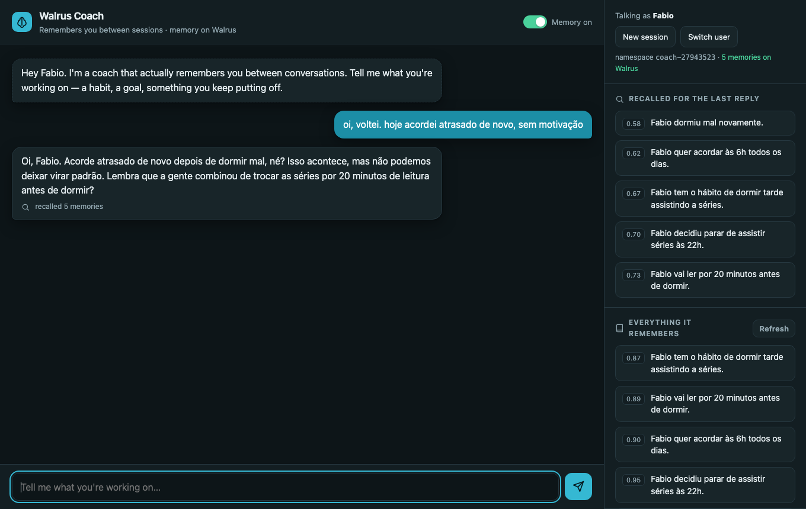

# Walrus Coach Bot

A coaching companion that actually remembers you between conversations. Runs as a
website (primary) and optionally as a Telegram bot — both share the same pipeline.
Long-term memory is stored encrypted on [Walrus](https://walrus.xyz) via
[Walrus Memory](https://memory.walrus.xyz); the LLM is **Qwen 3.8 27B (open-weight) running on Groq**
(no Anthropic/OpenAI in the loop).

Built for [Walrus Session 8: Chatbots That Remember](https://www.deepsurge.xyz/hackathons/c0141a4a-21be-4009-bc63-7c168608c849).

## How memory works

Every message goes through three steps ([src/chat.ts](src/chat.ts)):

1. **Recall** — two semantic queries against the user's own Walrus Memory namespace
   (`coach-<telegram user id>`): the message itself (cosine distance `< 0.8`) and a
   fixed "core profile" query (goal, deadline, schedule, constraints), merged and
   deduped — so even "hi, I'm back" surfaces what matters. ([src/memory.ts](src/memory.ts) → `recallForUser`)
2. **Generate** — the recalled facts are injected into the system prompt and the
   model answers with the short-term chat history. ([src/llm.ts](src/llm.ts))
3. **Learn** — after the reply is sent, durable facts (goals, habits, constraints,
   progress) are extracted from the exchange, deduplicated against what is already
   stored (recall with distance `< 0.25`), and each one is written as its own
   encrypted blob with `rememberAndWait`. The user never waits on storage.
   Set `MEMORY_EXTRACTOR=relayer` to use Walrus Memory's built-in `analyze` API
   instead of our own model for extraction ([src/extract.ts](src/extract.ts)).

Short-term context (last 12 turns) lives in RAM. Everything long-term lives on Walrus,
so restarting the bot, switching devices, or coming back a week later changes nothing.

Namespaces are the isolation boundary: user A's recall can never surface user B's
memories, even though both are written by the same delegate key.

## The web UI



[public/index.html](public/index.html) is a single-page chat served by [src/web.ts](src/web.ts).
Identity is deliberately Web2-flavoured: no wallet, no account. On first visit you type a
name; the browser generates a **memory key** (`web-<uuid>`), keeps it in `localStorage`, and
that key becomes the user's memory namespace on Walrus. The key is shown in the side panel
with a Copy button; pasting it on another device ("I have a memory key") restores the same
memories there. Under the hood every memory is still an encrypted blob on Walrus with
on-chain ownership — the user just never sees a wallet.

The side panel is the point of the UI: it shows **which memories were recalled for the last
reply** (with their cosine distance) and **everything stored for this user on Walrus**.
The "Memory" switch in the header turns recall + learning off so you can see the "before".

API (all JSON): `POST /api/chat {userId, name, text}` → `{reply, memories}`,
`GET /api/memories?userId=`, `POST /api/remember`, `POST /api/memory {enabled}`, `POST /api/reset`.

## Telegram (optional)

Same pipeline, different adapter ([src/index.ts](src/index.ts)). Set `TELEGRAM_BOT_TOKEN`
and run `npm run telegram`.

| Command | What it does |
|---|---|
| `/start` | Greets you — and if it knows you, picks up where you left off |
| `/memories` | Lists what the bot remembers about you (straight from Walrus) |
| `/remember <fact>` | Stores a fact explicitly |
| `/memory on\|off` | Toggles long-term memory — `off` shows the "before" behaviour |
| `/reset` | Clears short-term context only |

## Setup

Requirements: Node.js ≥ 18.

```bash
git clone <this repo>
cd walrus-coach-bot
npm install
cp .env.example .env
```

Fill in `.env`:

| Variable | Where to get it |
|---|---|
| `TELEGRAM_BOT_TOKEN` | optional — Telegram → [@BotFather](https://t.me/BotFather) → `/newbot` |
| `GROQ_API_KEY` | https://console.groq.com (free tier) |
| `MEMWAL_PRIVATE_KEY`, `MEMWAL_ACCOUNT_ID` | https://memory.walrus.xyz → create account → delegate key |
| `MEMWAL_SERVER_URL` | `https://relayer.memory.walrus.xyz` (mainnet) or `https://relayer-staging.memory.walrus.xyz` (testnet) |

Verify credentials with a real write + recall round-trip:

```bash
npm run check
```

Run the website (http://localhost:3000):

```bash
npm run web        # or: npm run web:dev (reload on change)
```

### Deploy to Vercel (no server to keep running)

The API is stateless (the browser sends its short-term history; long-term memory is on
Walrus), so it runs as a single Vercel function ([api/index.ts](api/index.ts)); background
learning is kept alive with `waitUntil`. From the project folder:

```bash
vercel deploy --prod \
  -e GROQ_API_KEY=... -e GROQ_MODEL=qwen/qwen3.8-27b \
  -e MEMWAL_PRIVATE_KEY=... -e MEMWAL_ACCOUNT_ID=... \
  -e MEMWAL_SERVER_URL=https://relayer.memory.walrus.xyz -e MEMWAL_NAMESPACE_PREFIX=coach
```

(or set the same variables in the Vercel dashboard and run `vercel deploy --prod`).

Run the Telegram bot instead (long polling — no public URL needed):

```bash
npm run telegram
```

Usage evidence for the write-up (messages and facts stored per user):

```bash
npm run stats
```

## Evaluation (before/after)

`npm run eval` simulates 3 users × 2 sessions in an isolated namespace prefix:
session 1 shares facts, session 2 wipes short-term context and sends probes whose
good answer depends on remembering session 1. Every probe is answered with memory
OFF and ON and checked against keywords only a remembering bot could produce.
Full transcripts land in `eval/report.md`.

The relayer allows ~1000 weighted requests per account per hour; one eval run uses
a good share of that, so run it at most once an hour or the writes start failing with 429.

## Project layout

```
src/app.ts      The JSON API (Hono, stateless) shared by local server and Vercel
src/web.ts      Local Node server: static page + API

public/index.html  The chat UI (vanilla HTML/CSS/JS, light + dark)
src/telegram.ts Telegram adapter (optional)
src/index.ts    Vercel entrypoint (re-exports the app)
src/memory.ts   Walrus Memory SDK wrapper (per-user namespaces)
src/llm.ts      Groq client and coach system prompt
src/extract.ts  Fact extraction with our own model (JSON out)
src/chat.ts     recall → generate → learn pipeline shared by bot and eval
src/stats.ts    Local per-user counters (evidence only; Walrus is the source of truth)
scripts/check.ts  Credential + round-trip check
scripts/stats.ts  Prints the usage table
scripts/eval.ts   Before/after evaluation with 3 simulated users
```

## Stack

- Runtime: Node.js + TypeScript (`tsx`)
- Web: [Hono](https://hono.dev) on Node
- Telegram (optional): [grammY](https://grammy.dev)
- LLM: `qwen/qwen3.8-27b` via Groq's OpenAI-compatible API
- Memory: `@mysten-incubation/memwal` (Walrus + SEAL encryption + Sui ownership)

## License

MIT
